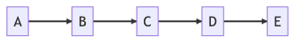
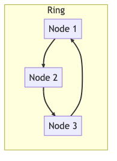

# **Golang Study**

## 장진수

---

### 목차

1. 자료구조
2. 에러핸들링
3. 고루틴
4. 채널과 컨텍스트

---

### 1. 자료구조(data structure)

**목차**

1.1. 자료구조란?
1.2. 리스트(List)
1.3. 링(Ring)
1.4. 맵(Map)

---

### 1.1. 자료구조란?

**데이터 값의 모임**, 각 원소들이 논리적으로 정의된 규칙에 의해 나열되며 자료에 대한 처리를 효율적으로 수행할 수 있도록 자료를 구분하여 표현한 것.

ex) 데이터 -> 책, 메모리 -> 책장

책을 책장에 남는 공간이 없게 정리할 수 도 있을 것이고, 책을 찾기 쉽게 찾기 위해서 장르별로 분리하거나 제목 순서별로 정렬하는 등의 일련의 행위 -> 데이터를 목적에 부합하는 효율적인 방법을 위한 구조 [자료구조]

---

### 1.2. 리스트(List)

**리스트(List)** 는 일련의 항목들을 저장하고 조작하는 자료 구조입니다.

각 항목은 순서대로 나열되며, 각각의 항목은 데이터와 다음 항목에 대한 참조(포인터 또는 링크)를 가지고 있습니다.



리스트는 배열과는 다르게 동적으로 크기를 변경할 수 있습니다. 때문에, 리스트는 데이터를 자주 추가하거나 제거하는 상황에서 유용하게 사용됩니다. 또한, 리스트는 항목이 추가되거나 제거될 때마다 다시 할당할 필요가 없어 메모리를 효율적으로 사용할 수 있습니다.

---

### 1.2 리스트(List)

**특징**

-   동적 크기 변경 -> 데이터 추가, 제거

**활용** : 자료의 추가, 삭제, 검색

-   데이터베이스의 인덱스
-   운영체제의 프로세스,스레드의 스케줄링

---

### 1.2 리스트(List) - 예제코드 1

```go
// data_structure/list.go
package main

import (
	"container/list"
	"fmt"
)

func main() {
	fmt.Println("List A")

	listA := list.New()

	listA.PushBack("A")
	listA.PushBack(100)
	listA.PushBack(true)
	// "A", 100, true
```

---

### 1.2 리스트(List) - 예제코드 1

```go
        fmt.Println("List B")
	listB := list.New()

	listB.PushBack("B")
	listB.PushFront("C")
	// "C", "B"

	fmt.Println("-------------")
	fmt.Println("List A + List B")

	listA.PushBackList(listB)
	// "A", 100, true, "C", "B"
```

---

### 1.2 리스트(List) - 예제코드 2

```go
// data_structure/list_stack.go
func main() {
    stack := list.New()

    // Push elements onto stack
    stack.PushBack(1)
    stack.PushBack(2)
    stack.PushBack(3)

    // Pop elements from stack
    for stack.Len() > 0 {
        e := stack.Back()
        stack.Remove(e)
        fmt.Println(e.Value)
    }
}
```

---

### 1.3 링(Ring)

**링(Ring)** 은 원형으로 연결된 리스트로, 각 노드가 다음 노드를 가리키는 포인터를 가지고 있습니다. 마지막 노드는 첫 번째 노드를 가리키며, 이를 통해 원형 구조를 이루게 됩니다. 이러한 구조를 통해 리스트의 마지막 노드에서 처음 노드로 바로 이동할 수 있습니다. 링은 주로 버퍼와 같은 순환적인 자료구조에서 사용됩니다.



---

### 1.3 링(Ring)

```go
package main

import (
	"container/ring"
	"fmt"
)

func main() {
	// 길이 3인 ring 생성
	r := ring.New(3)
	for i := 1; i <= 3; i++ {
		r.Value = i
		r = r.Next()
	}
	// 링의 요소를 연결
	r.Next().Link(r.Prev())

	r.Do(func(a interface{}) { fmt.Println(a) })
	// 1, 2, 3
	fmt.Println("현재 노드:", r.Value) // 1
	fmt.Println("---------------")

	// 1만큼 시계방향 회전, - 음수는 반시계
	r = r.Move(1)
	r.Do(func(a interface{}) { fmt.Println(a) })
	// 2, 3, 1
	fmt.Println("현재 노드:", r.Value) // 2
}

```

---

### 1.4 맵(Map)

**맵(Map)** 은 키-값 쌍(key-value pair)을 저장하는 자료구조 중 하나입니다.

Map은 특정 키에 대응하는 값을 빠르게 검색할 수 있으므로, 검색 연산에 높은 성능을 보입니다. 키와 값을 쌍으로 저장하므로, 키가 중복되지 않는 한 유일한 값을 가지게 됩니다.

---

### 1.4 맵(Map) - 예제코드

```go
func main() {
    // 빈 맵 생성
    m := make(map[string]int)

    // key-value 쌍 추가
    m["apple"] = 1
    m["banana"] = 2
    m["orange"] = 3

    // 특정 key에 대한 value 조회
    fmt.Println("apple:", m["apple"])

    // 존재하지 않는 key에 대한 조회는 zero value 반환
    fmt.Println("grape:", m["grape"])

    // map 길이 출력
    fmt.Println("length:", len(m))

    // key-value 삭제
    delete(m, "orange")
    fmt.Println("after deletion:", m)
}
```

---

### 2. 에러핸들링(error handling)

**목차**

1. 에러반환
2. 패닉

---

### 2.1 에러반환

```go
func divide(a, b float64) (float64, error) {
	if b == 0 {
		return 0.0, errors.New("cannot divide through zero")
	}
	return a / b, nil
}

func main() {
	num1, err := divide(100, 0)
	if err != nil {
		fmt.Println("error occurred:", err)
	}
	// error occurred: cannot divide through zero
	fmt.Println("Number:", num1)

	fmt.Println("------------------------")

	num2, err := divide(200, 0)
	if err != nil {
		log.Printf("error occurred: %v", err)
	}
	// 2023/04/20 22:15:52 error occurred: cannot divide through zero
	fmt.Println("Number:", num2)
}
```

---

### 2.2 패닉

```go
func divide(a, b float64) (float64, error) {
	if b == 0 {
		return 0.0, errors.New("cannot divide through zero")
	}
	return a / b, nil
}

func main() {
	defer func() {
		if r := recover(); r != nil {
			log.Println("recovered from panic:", r)
		}
	}()
	num, err := divide(300, 0)
	if err != nil {
		panic(fmt.Errorf("error occurred: %w", err))
	}
	// panic: error occurred: cannot divide through zero
	//
	// goroutine 1 [running]:
	// main.main()
	//         /home/huketo/go-study/error/error.go:39 +0x2ae
	// exit status 2
	fmt.Println("Number:", num)
}
```

---

### 3. 고루틴(goroutine)

**목차**

1. 동시성 프로그래밍
2. 스레드란?
3. 고루틴
4. 고루틴의 동작 방법
5. 동시성 프로그래밍 주의점
6. 뮤텍스와 데드락

---

### 3.1 동시성 프로그래밍

**동시성 프로그래밍(Concurrency Programming)** : 여러 작업이 동시에 실행될 수 있도록 하는 프로그래밍 기법

일반적으로 한 번에 하나의 작업만 처리하는 기본적인 프로그래밍 모델과는 달리, 동시성 프로그래밍에서는 여러 작업이 동시에 실행되기 때문에 병렬 처리가 가능해지며, 이를 통해 시스템의 성능을 향상시킬 수 있습니다.

---

### 3.2 스레드란?

1. 프로세스(Process) : 운영체제에서 할당하는 자원의 단위

프로세스는 각각 독립적인 메모리 공간을 가지고 있습니다. 프로세스는 자신만의 주소 공간에서 동작하며, 다른 프로세스의 자원에 직접 접근할 수 없습니다. -> IPC

2. 스레드(Thread) : light-weight process

스레드는 하나의 프로세스 내에서 동시에 실행되는 실행 흐름입니다. 스레드는 프로세스의 자원을 공유하면서 동작하므로, 스레드 간의 통신과 동기화 문제에 대한 고려가 필요합니다.

---

### 3.3 고루틴

**동시성 프로그래밍 모델** : 프로세스, 스레드, 코루틴

-   코루틴(Coroutine)
    코루틴은 스레드와 비슷하지만, 스레드보다 더 가벼운 실행 흐름입니다. 코루틴은 하나의 스레드 내에서 동작하며, 스레드가 공유하는 자원을 직접 접근할 수 있습니다. 코루틴은 일반적으로 스레드보다 생성 및 스위칭 비용이 적기 때문에, 대규모 동시성 처리에서 성능상 이점이 있습니다.

Go의 고루틴(Goroutine) <- 코루틴(Coroutine)

---

### 고루틴 - 예제코드

```go
func printNumbers(from, to int) {
	for i := from; i <= to; i++ {
		fmt.Printf("%d ", i)
		time.Sleep(100 * time.Millisecond)
	}
}

func main() {
	go printNumbers(0, 4) // 새로운 고루틴 생성
	go printNumbers(5, 9) // 새로운 고루틴 생성
	time.Sleep(2 * time.Second) // main 고루틴 대기
}

// 5 0 1 6 7 2 8 3 4 9
// 5 0 1 6 2 7 3 8 4 9
// 출력결과가 동일하지 않음
```

---

### 3.4 고루틴의 동작방법

Go의 고루틴은 Go 런타임에 의해 관리됩니다. 고루틴은 스레드와는 달리, 사용자 수준에서 스케줄링됩니다. Go 런타임은 고루틴이 블록되거나 I/O 작업을 수행해야 할 때, 해당 고루틴을 중지하고 다른 고루틴으로 전환합니다.

Go에서 고루틴을 생성할 때, Go 런타임은 고루틴 스케줄링을 위한 작은 스택을 생성합니다. 각 고루틴은 이 작은 스택을 사용하여 실행됩니다. 이 스택은 일반적으로 몇 KB에서 몇 MB까지 크기가 다르며, 실제 사용량에 따라 동적으로 조정됩니다.

---

### 3.5 동시성 프로그래밍 주의점

**철학자의 원탁**

-   원형식탁에는 N개의 음식이 있습니다.
-   모든 철학자는 한 개의 포크를 들어야 음식을 먹을 수 있습니다.
-   각 철학자는 자신의 왼쪽과 오른쪽에 있는 포크를 사용해야 합니다.
-   철학자들은 한 번에 한 명씩 음식을 먹습니다.

→ 자원 점유 문제 -> 데드락 현상

---

### 3.6 뮤텍스와 데드락

-   **데드락(Deadlock)**
    데드락은 둘 이상의 프로세스나 스레드가 서로가 가지고 있는 자원을 점유하고 대기하면서, 다른 프로세스나 스레드가 가지고 있는 자원을 요청하며, 이러한 상황이 영원히 해결되지 않는 상태를 말합니다.

-   **뮤텍스(Mutual Exclusion; Mutex, 상호배제)**
    뮤텍스는 공유 자원을 사용할 때 발생할 수 있는 경쟁 상황을 해결하기 위한 동기화 기법 중 하나입니다. 뮤텍스를 사용하면 오직 하나의 공유 자원만이 접근 가능하며, 다른 프로세스나 스레드는 대기해야 합니다.

---

### 3.6 뮤텍스와 데드락 - 예제코드

```go
func philosopher(leftFork, rightFork *sync.Mutex) {
    for {
        leftFork.Lock()
        rightFork.Lock()
        fmt.Println("eating")
        leftFork.Unlock()
        rightFork.Unlock()
        fmt.Println("thinking")
        time.Sleep(time.Millisecond * 500)
    }
}

func main() {
    forks := make([]*sync.Mutex, 5)
    for i := 0; i < 5; i++ {
        forks[i] = &sync.Mutex{}
    }

    for i := 0; i < 5; i++ {
        go philosopher(forks[i], forks[(i+1)%5])
    }

    var input string
    fmt.Scanln(&input)
}
```

---

### 4. 채널과 컨텍스트

**목차**

1. 채널
2. 컨텍스트
